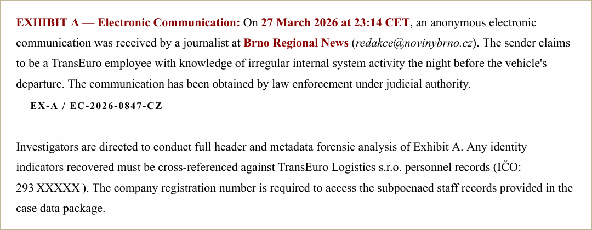
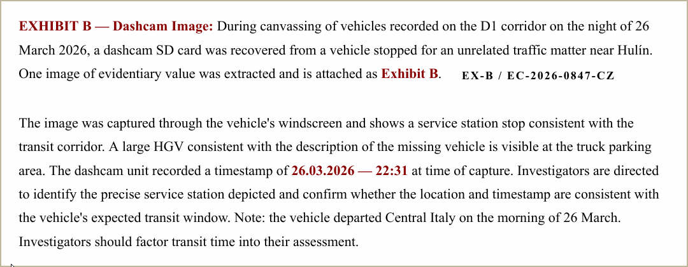

# TryHackMe - Have a Break

_"On 26 March 2026, a refrigerated truck carrying over 400,000 units of KitKat product vanished somewhere between Central Italy and Poland. Nestlé confirmed the theft two days later. The vehicle has not been found._

_The European Cargo Threat Assessment (ECTA) does not believe this was opportunistic. A shipment of this size, on a contracted route, does not disappear without someone helping it along._

_An anonymous tip reached a journalist the following evening. ECTA obtained it under judicial authority. That is where your investigation begins."_

---

## Executive Summary

This investigation analyses a suspected insider-facilitated cargo theft involving a high-value shipment transiting from Italy to Poland.

Email header analysis identified the use of a VPN service, indicating deliberate anonymisation by the sender. Geolocation of a service station image confirmed the vehicle’s presence along the expected transit corridor near Hulín, Czechia.

Analysis of internal access logs revealed anomalous late-night export activity involving sensitive route data. Correlation of these events identified a route planner as the likely source of the leak, while a separate employee was determined to be the anonymous whistleblower.

Final attribution was achieved via OSINT enrichment of an associated email account, linking the activity to a specific individual.

---

## Scenario Context

The case file describes the disappearance of a refrigerated HGV operated by TransEuro Logistics s.r.o., transporting approximately 413,793 units of confectionery product (≈12 tonnes) from Central Italy to Poland.

The vehicle failed to complete scheduled check-ins and did not arrive at its destination. As of 28 March 2026, both the vehicle and cargo remain unaccounted for.

Preliminary intelligence assessment identified multiple indicators consistent with insider involvement:

- Deviation from monitoring schedules without triggering alerts  
- Prior knowledge of shipment contents  
- Restricted access to route planning data within the Brno office  

These factors significantly reduce the likelihood of opportunistic theft and suggest controlled data leakage prior to departure.

---

## Phase 1 – Email Analysis (Origin Identification)

The investigation begins with analysis of an anonymous email submitted to a journalist.

>I work for the logistics company that was moving the Nestle shipment.

>I do not know who took it or where it is. But I know it was not
opportunistic. Someone gave the route details to someone outside
before that truck left. I saw unusual activity in our internal
system the night before departure. Access to a file that had no
reason to be touched at that hour.

>I am not going to the police directly. I do not know who to trust
inside the company right now. I am sending this to you because you
cover local business and I think this should be public.

>I cannot say more about who I am.

### Evidence

Inspection of the email headers reveals the originating IP address:

Received: from [193.32.249.132]

### Analysis

The lowest `Received` header typically reflects the originating client in SMTP relay chains. Extracting this IP allows attribution of the sending infrastructure.

An IP intelligence lookup links the address to a known VPN provider.

### Finding

The email was sent via:

> **Mullvad VPN**

### Assessment

The use of a privacy-focused VPN indicates deliberate anonymisation. This behaviour is consistent with a whistleblower attempting to avoid identification.

---

## Phase 2 – Geolocation of Last Known Location

A dashcam image provides the last confirmed sighting of the vehicle.

### Evidence

The image includes:

- ORLEN petrol station branding  
- Distance markers:
  - Olomouc – 27 km  
  - Brno – 45 km  
- Reference to the D1 motorway  
- Additional context indicating proximity to Hulín  

### Analysis

The distance markers constrain the location to a corridor between Olomouc and Brno. Hulín aligns closely with both distances and sits near a major motorway junction connecting relevant transit routes.

Cross-referencing fuel stations in this area identifies a single viable match.

### Finding

The location corresponds to:

> **Kroměřížská 1281, 768 24 Hulín, Czechia**

### Assessment

The timestamp (22:31) aligns with expected transit time from Central Italy, supporting the hypothesis that the vehicle remained on its planned route prior to disappearance.

---

## Phase 3 – Detection of Insider Activity

Internal access logs were analysed to identify anomalous behaviour prior to the incident.

### Evidence

A critical event was identified:

### Analysis

This event is notable for three reasons:

- Occurred outside normal working hours  
- Involved export (data extraction), not passive access  
- Targeted a sensitive route planning document  

### Finding

The suspicious activity occurred at:

> **22:14:09**

### Assessment

Late-night export of sensitive routing data strongly indicates intentional data exfiltration rather than routine access.

---

## 🧾 Phase 4 – Source Identification (Anonymous Email)

Following identification of anomalous activity within the route planning system, attention returns to the anonymous email.

### Evidence

The sender states:

> "I saw unusual activity in our internal system the night before departure. Access to a file that had no reason to be touched at that hour."

### Analysis

This indicates direct awareness of internal system activity without claiming responsibility.

Reviewing log activity following the export event shows continued system access by another employee, consistent with someone observing or reviewing events rather than performing them.

### Finding

The anonymous email was sent by:

> **Employee ID: BR-0312**

### Assessment

This individual is assessed to be a **whistleblower**, not the source of the leak. Their behaviour suggests awareness of internal irregularities combined with reluctance to report through internal channels.

---

## Phase 5 – Insider Identification

With the whistleblower identified, focus shifts to the source of the data leak.

### Evidence

The earlier export event:

2026-03-25 22:14:09 — BR-0291 — ROUTE_IT_PL_Q1_2026.pdf — EXPORT

### Analysis

This action represents:

- Direct access to sensitive route data  
- Intentional extraction (export)  
- Timing consistent with pre-incident preparation  

### Finding

The employee responsible for leaking the shipment details is:

> **BR-0291**

### Assessment

This behaviour is consistent with insider-assisted data exfiltration and represents the most probable source of the compromised route information.

---

## Phase 6 – Identity Attribution

An internal communication references an external email address attempting to access company files:

kraliknovak09[@]gmail.com

### Analysis

The username does not directly reveal identity, requiring external OSINT enrichment.

### Method

The email was analysed using **Epieos**, an OSINT tool that retrieves publicly available Google account metadata.

### Finding

The account is associated with:

> **Radovan Blšťák**

### Assessment

This step relies on external data correlation rather than analytical deduction but provides strong attribution linking the insider activity to a real-world identity. The finding also correlates with the earlier data pointing to the fuel station.

---

## Key Findings

- The anonymous email originated from within the organisation and was sent via Mullvad VPN  
- The vehicle was last observed near Hulín, consistent with its planned transit route  
- Sensitive route data was exported late at night prior to the incident  
- The email sender (BR-0312) acted as a whistleblower  
- The data leak originated from employee BR-0291  
- OSINT enrichment linked the activity to Radovan Blšťák  

---

## Final Assessment

This case demonstrates a clear instance of insider-facilitated data leakage leading to cargo theft.

The attack did not rely on technical exploitation, but rather on legitimate access to sensitive operational data. The ability to identify anomalous behaviour within otherwise normal system usage proved critical.
